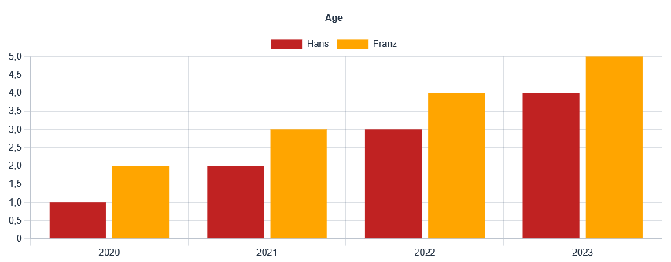

[](https://vaadin.com/directory/component/vaadin-chartjs-wrapper)
[](https://mvnrepository.com/artifact/software.xdev/vaadin-chartjs-wrapper)
[](https://github.com/xdev-software/vaadin-chartjs-wrapper/actions/workflows/check-build.yml?query=branch%3Adevelop)
[](https://sonarcloud.io/dashboard?id=xdev-software_vaadin-chartjs-wrapper)


# Chart.js Wrapper for Vaadin

A Chart.js 4+ Wrapper for Vaadin



## Usage

1. Define a custom chart or use the ``showChart``-method directly.<br/>Example:

  ```java
  public class ExampleChartContainer extends ChartContainer
  {
    public void show(Data data)
    {
      BarData data = ...; // Build the bar chart data from the handed over data
      this.showChart(new BarChart(data)
        .setOptions(new BarOptions()
          .setResponsive(true)
          .setMaintainAspectRatio(false)
          .setPlugins(new Plugins()
            .setTitle(new Title()
              .setText("Age")
              .setDisplay(true))))
        .toJson());
    }
  }
  ```

2. Add the chart to your view/component:

  ```java
  public class ExampleView extends VerticalLayout
  {
    private final ExampleChartContainer chart = new ExampleChartContainer();
    
    public ExampleView()
    {
      this.add(this.chart);
      // ...
    }
    
    private void loadDataAndShowChart()
    {
      this.chart.showLoading();
      
      UI ui = UI.getCurrent();
      CompletableFuture.runAsync(() -> {
        try {
          var data = ...; // Load some data from the backend
          // You may also convert the data here and call showChart
          ui.access(() -> this.chart.show(data));
        } catch (Exception ex) {
          // Display the error message when loading fails
          ui.access(() -> this.chart.showFailed(ex.getMessage()));
        }
      });
    }	
  }
  ```

For more usage examples please have a look at [the demo](./vaadin-chartjs-wrapper-demo/src/main/java/software/xdev/vaadin/chartjs/demo/).

## Installation
[Installation guide for the latest release](https://github.com/xdev-software/vaadin-chartjs-wrapper/releases/latest#Installation)

### Spring-Boot
* You may have to include ``software/xdev`` inside [``vaadin.allowed-packages``](https://vaadin.com/docs/latest/integrations/spring/configuration#configure-the-scanning-of-packages)

## Run the Demo
* Checkout the repo
* Run ``mvn install && mvn -f vaadin-chartjs-wrapper-demo spring-boot:run``
* Open http://localhost:8080

<details>
  <summary>Show example</summary>
  
  
</details>

## Support
If you need support as soon as possible and you can't wait for any pull request, feel free to use [our support](https://xdev.software/en/services/support).

## Contributing
See the [contributing guide](./CONTRIBUTING.md) for detailed instructions on how to get started with our project.

## Dependencies and Licenses
View the [license of the current project](LICENSE) or the [summary including all dependencies](https://xdev-software.github.io/vaadin-chartjs-wrapper/dependencies)
